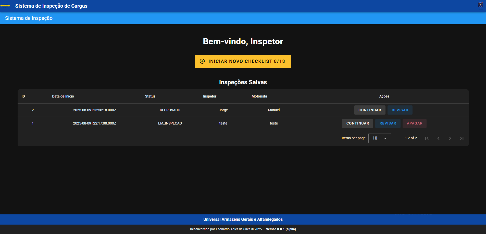
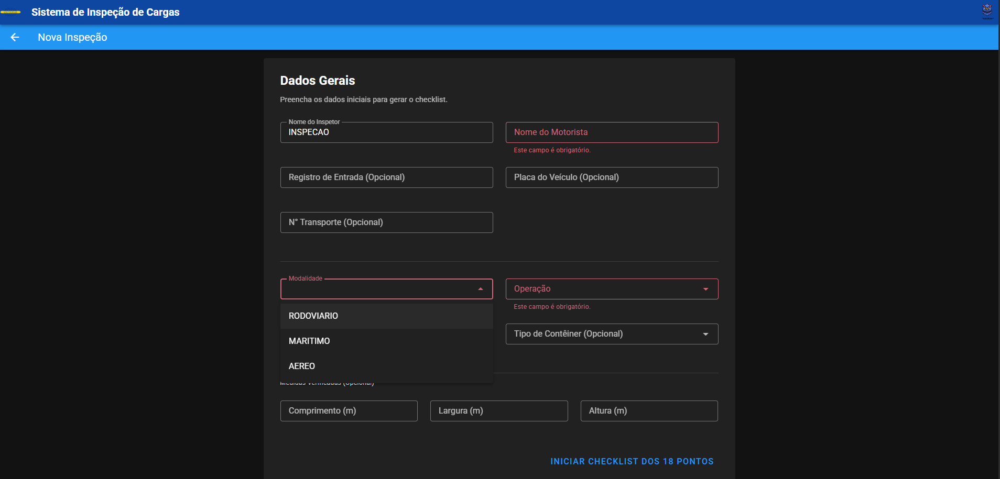
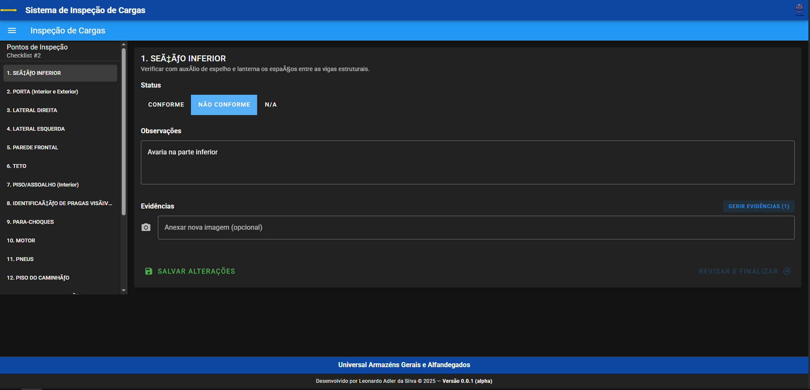
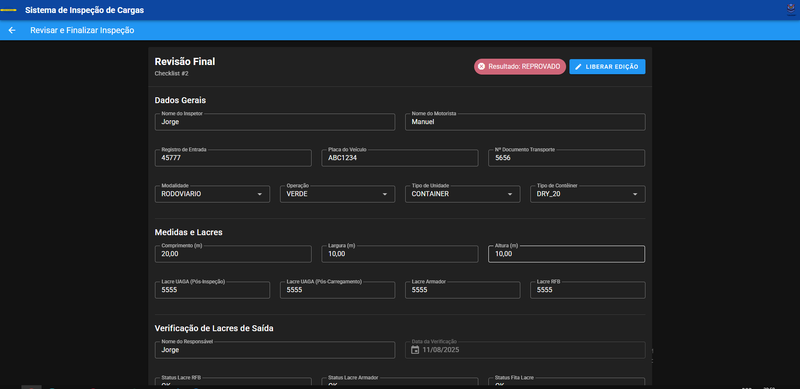
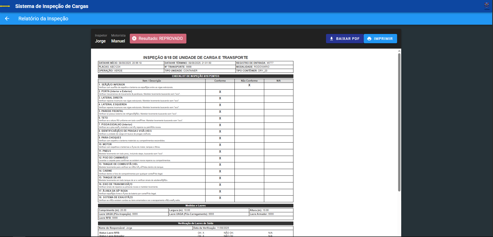
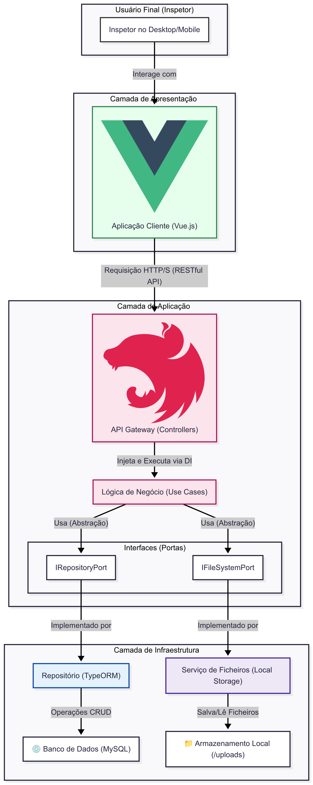
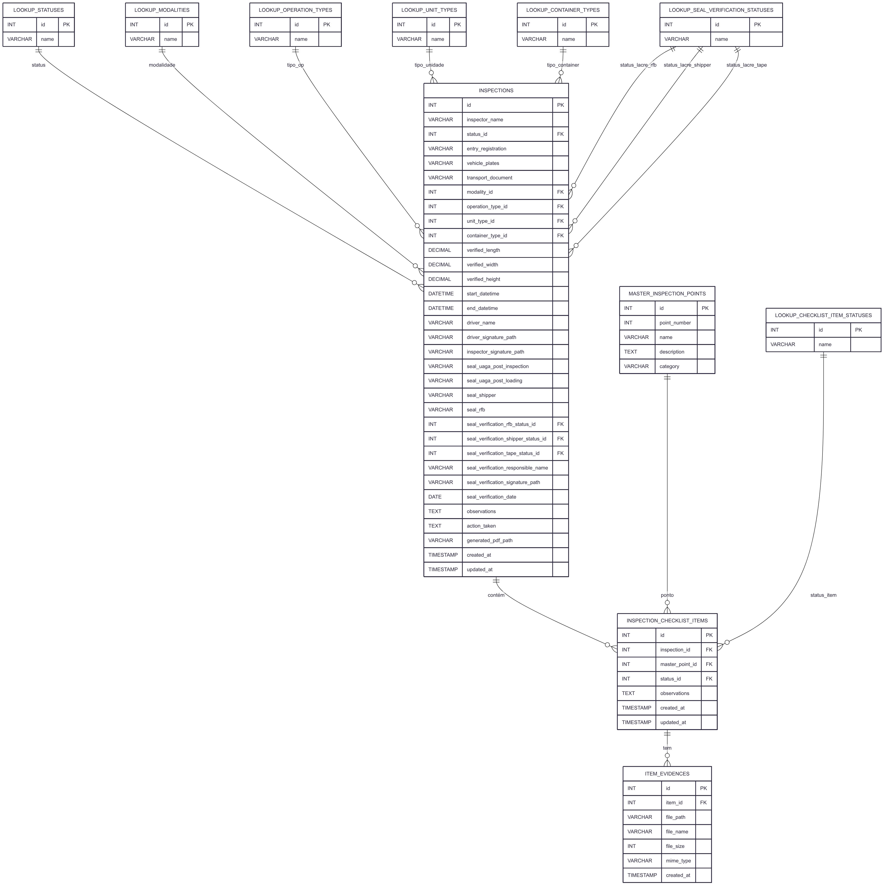

<h1 style="color: #2c3e50; border-bottom: 2px solid #3498db; padding-bottom: 10px; margin-top: 20px;">
    Bem-vindo ao Meu Portfólio de Projetos
</h1>

by Leonardo Adler da Silva

<h2 style="color: #2c3e50; border-bottom: 1px solid #ccc; padding-bottom: 5px; margin-top: 40px;">Sobre Mim</h2>

    Sou <strong>Leonardo Adler da Silva</strong>, de <strong>São José dos Campos</strong>, apaixonado por <strong>tecnologia</strong> e <strong>esportes</strong>. Minha jornada profissional começou no <strong>Banco do Brasil</strong> e, desde então, venho buscando desafios que me permitam crescer.

    Meu interesse por tecnologia começou na infância, ao montar meu próprio PC, e me levou a cursar <strong>Banco de Dados</strong> na <strong>Fatec São José dos Campos</strong>. Atualmente, sou <strong>Analista de Sistemas e Desenvolvedor Full-Stack</strong> na <strong>Universal Armazéns Gerais e Alfandegados</strong>, onde lidero projetos de software e aplico meu conhecimento em tecnologias como <strong>Node.js (NestJS)</strong> e <strong>Java (Spring Boot)</strong> para criar soluções de alto impacto.

<h3 style="color: #2c3e50; margin-top: 30px;">Contato</h3>
<ul style="list-style-type: none; padding-left: 0;">
    <li style="margin-bottom: 10px;"><strong>Email:</strong> <a href="mailto:leonardoadlersilva@gmail.com" style="color: #3498db; text-decoration: none;">leonardoadlersilva@gmail.com</a></li>
    <li style="margin-bottom: 10px;"><strong>LinkedIn:</strong> <a href="https://www.linkedin.com/in/leonardo-adler-6b4a37228/" target="_blank" style="color: #3498db; text-decoration: none;">https://www.linkedin.com/in/leonardo-adler-6b4a37228/</a></li>
</ul>

<h3 style="color: #2c3e50; margin-top: 30px;">Minhas Principais Tecnologias e Habilidades</h3>
<table style="width:100%; border-collapse: collapse; margin-top: 20px;">
    <thead>
        <tr style="background-color: #f2f2f2;">
            <th style="border: 1px solid #ddd; padding: 12px; text-align: left;">Tecnologia</th>
            <th style="border: 1px solid #ddd; padding: 12px; text-align: left;">Descrição</th>
            <th style="border: 1px solid #ddd; padding: 12px; text-align: left;">Projetos Destacados</th>
            <th style="border: 1px solid #ddd; padding: 12px; text-align: left;">Nível de Proficiência</th>
        </tr>
    </thead>
    <tbody>
        <tr>
            <td style="border: 1px solid #ddd; padding: 12px; vertical-align: top;">Git</td>
            <td style="border: 1px solid #ddd; padding: 12px; vertical-align: top;">Versionamento de código utilizando os workflows <b>Git Flow</b> e <b>Trunk-Based Development</b> para gerenciamento eficiente de branches e deploy contínuo.</td>
            <td style="border: 1px solid #ddd; padding: 12px; vertical-align: top;">
                <ul style="margin: 0; padding-left: 20px;">
                    <li>App de Inspeção 8/18</li>
                    <li>Análise de Endossantes (SPC Grafeno)</li>
                    <li>Dashboard para Faturas (TECSUS)</li>
                </ul>
            </td>
            <td style="border: 1px solid #ddd; padding: 12px; vertical-align: top;">Avançado</td>
        </tr>
        <tr>
            <td style="border: 1px solid #ddd; padding: 12px; vertical-align: top;">Node.js (Nest.js)</td>
            <td style="border: 1px solid #ddd; padding: 12px; vertical-align: top;">Framework backend para criação de APIs RESTful estruturadas, escaláveis e eficientes, aplicando princípios de Injeção de Dependência e arquitetura modular.</td>
            <td style="border: 1px solid #ddd; padding: 12px; vertical-align: top;">
                <ul style="margin: 0; padding-left: 20px;">
                    <li>App de Inspeção 8/18</li>
                    <li>Análise de Endossantes (SPC Grafeno)</li>
                    <li>Dashboard para Faturas (TECSUS)</li>
                </ul>
            </td>
            <td style="border: 1px solid #ddd; padding: 12px; vertical-align: top;">Avançado</td>
        </tr>
        <tr>
            <td style="border: 1px solid #ddd; padding: 12px; vertical-align: top;">Java / Spring Boot</td>
            <td style="border: 1px solid #ddd; padding: 12px; vertical-align: top;">Programação orientada a objetos e desenvolvimento de APIs RESTful robustas e serviços escaláveis.</td>
            <td style="border: 1px solid #ddd; padding: 12px; vertical-align: top;">
                <ul style="margin: 0; padding-left: 20px;">
                     <li>Controle de Anomalias Prediais (JAIA)</li>
                     <li>Automação de Dados Meteorológicos (IACIT)</li>
                </ul>
            </td>
            <td style="border: 1px solid #ddd; padding: 12px; vertical-align: top;">Avançado</td>
        </tr>
         <tr>
            <td style="border: 1px solid #ddd; padding: 12px; vertical-align: top;">Vue.js</td>
            <td style="border: 1px solid #ddd; padding: 12px; vertical-align: top;">Framework JavaScript para desenvolvimento de interfaces de usuário interativas e reativas.</td>
            <td style="border: 1px solid #ddd; padding: 12px; vertical-align: top;">
                <ul style="margin: 0; padding-left: 20px;">
                    <li>App de Inspeção 8/18</li>
                    <li>Análise de Endossantes (SPC Grafeno)</li>
                    <li>Dashboard para Faturas (TECSUS)</li>
                </ul>
            </td>
            <td style="border: 1px solid #ddd; padding: 12px; vertical-align: top;">Intermediário</td>
        </tr>
         <tr>
                <td style="border: 1px solid #ddd; padding: 12px; vertical-align: top;">Docker & CI/CD</td>
                <td style="border: 1px solid #ddd; padding: 12px; vertical-align: top;">Criação de ambientes de desenvolvimento e teste totalmente containerizados com <b>Docker Compose</b>. Experiência na automação de pipelines de testes (unitários e E2E) como base para processos de Integração Contínua (CI).</td>
                <td style="border: 1px solid #ddd; padding: 12px; vertical-align: top;">
                    <ul style="margin: 0; padding-left: 20px;">
                        <li>App de Inspeção 8/18</li>
                        <li>Análise de Endossantes (SPC Grafeno)</li>
                        <li>Dashboard para Faturas (TECSUS)</li>
                    </ul>
                </td>
                <td style="border: 1px solid #ddd; padding: 12px; vertical-align: top;">Intermediario</td>
            </tr>
        <tr>
                <td style="border: 1px solid #ddd; padding: 12px; vertical-align: top;">Testes Automatizados</td>
                <td style="border: 1px solid #ddd; padding: 12px; vertical-align: top;">Implementação de suítes de testes para garantir a qualidade e a estabilidade do software, com foco em <b>Testes Unitários</b> para a lógica de negócio (Use Cases) e <b>Testes End-to-End (E2E)</b> para validar os fluxos completos da aplicação.</td>
                <td style="border: 1px solid #ddd; padding: 12px; vertical-align: top;">
                    <ul style="margin: 0; padding-left: 20px;">
                        <li>App de Inspeção 8/18</li>
                    </ul>
                </td>
                <td style="border: 1px solid #ddd; padding: 12px; vertical-align: top;">Intermediario (Unitários) Intermediário (E2E)</td>
            </tr>
        </tbody>
</table>

<h2 style="color: #2c3e50; border-bottom: 1px solid #ccc; padding-bottom: 5px; margin-top: 40px;">🚀 Projetos</h2>
<table style="width:100%; border-collapse: collapse; margin-top: 20px;">
    <thead>
        <tr style="background-color: #f2f2f2;">
            <th style="border: 1px solid #ddd; padding: 12px; text-align: left;">Projeto</th>
            <th style="border: 1px solid #ddd; padding: 12px; text-align: left;">Descrição</th>
            <th style="border: 1px solid #ddd; padding: 12px; text-align: left;">Tecnologias</th>
            <th style="border: 1px solid #ddd; padding: 12px; text-align: left;">Cliente</th>
        </tr>
    </thead>
    <tbody>
        <tr style="background-color: #e8f4fd;">
            <td style="border: 1px solid #ddd; padding: 12px; vertical-align: top;"><strong><a href="#portfolio7Checklist" style="color: #3498db; text-decoration: none;">App de Inspeção 8/18 (2025)</a></strong></td>
            <td style="border: 1px solid #ddd; padding: 12px; vertical-align: top;">Desenvolvimento de uma solução full-stack para digitalizar e otimizar o processo de inspeção de cargas, atuando como o principal desenvolvedor e gestor do projeto.</td>
            <td style="border: 1px solid #ddd; padding: 12px; vertical-align: top;">NestJS, Vue.js, Docker, TypeORM, MySQL</td>
            <td style="border: 1px solid #ddd; padding: 12px; vertical-align: top;">Universal Armazéns (Interno)</td>
        </tr>
        <tr>
            <td style="border: 1px solid #ddd; padding: 12px; vertical-align: top;"><a href="#portfolio6SPCGrafeno" style="color: #3498db; text-decoration: none;">Análise de Crédito com IA (2024)</a></td>
            <td style="border: 1px solid #ddd; padding: 12px; vertical-align: top;">Desenvolvimento de produtos financeiros inovadores utilizando aprendizado de máquina para analisar a confiabilidade de endossantes e prever tendências de ativos financeiros.</td>
            <td style="border: 1px solid #ddd; padding: 12px; vertical-align: top;">Node.js, Vue.js, FastAPI, Machine Learning, MongoDB, PostgreSQL, Docker</td>
            <td style="border: 1px solid #ddd; padding: 12px; vertical-align: top;">SPC Grafeno</td>
        </tr>
        <tr>
            <td style="border: 1px solid #ddd; padding: 12px; vertical-align: top;"><a href="#portfolio5Tecsus" style="color: #3498db; text-decoration: none;">Dashboard de Faturas (2024)</a></td>
            <td style="border: 1px solid #ddd; padding: 12px; vertical-align: top;">Desenvolvimento de um dashboard web para análise de faturas de energia e água, com o objetivo de otimizar contratos e reduzir custos para empresas clientes da TecSUS.</td>
            <td style="border: 1px solid #ddd; padding: 12px; vertical-align: top;">Node.js, Vue.js, Power BI, MySQL, Docker</td>
            <td style="border: 1px solid #ddd; padding: 12px; vertical-align: top;">TECSUS</td>
        </tr>
        <tr>
            <td style="border: 1px solid #ddd; padding: 12px; vertical-align: top;"><a href="#portfolio4Jaia" style="color: #3498db; text-decoration: none;">Controle de Anomalias Prediais (2023)</a></td>
            <td style="border: 1px solid #ddd; padding: 12px; vertical-align: top;">Desenvolvimento de um sistema para controlar anomalias em Laudos de Inspeção Predial, gerenciando manutenções preventivas e corretivas.</td>
            <td style="border: 1px solid #ddd; padding: 12px; vertical-align: top;">Vue.js, Java, SpringBoot, Oracle Cloud, Docker</td>
            <td style="border: 1px solid #ddd; padding: 12px; vertical-align: top;">JAIA</td>
        </tr>
        <tr>
            <td style="border: 1px solid #ddd; padding: 12px; vertical-align: top;"><a href="#portfolio3IACIT" style="color: #3498db; text-decoration: none;">Automação de Dados Meteorológicos (2023)</a></td>
            <td style="border: 1px solid #ddd; padding: 12px; vertical-align: top;">Desenvolvimento de um sistema para automatizar a importação e o armazenamento de dados meteorológicos, permitindo a geração de relatórios customizados.</td>
            <td style="border: 1px solid #ddd; padding: 12px; vertical-align: top;">Java, SpringBoot, PostgreSQL</td>
            <td style="border: 1px solid #ddd; padding: 12px; vertical-align: top;">IACIT</td>
        </tr>
        <tr>
            <td style="border: 1px solid #ddd; padding: 12px; vertical-align: top;"><a href="#portfolio2DomRock" style="color: #3498db; text-decoration: none;">Gestão de Ativação de Clientes (2022)</a></td>
            <td style="border: 1px solid #ddd; padding: 12px; vertical-align: top;">Desenvolvimento de uma solução desktop para gestão da ativação de clientes, permitindo a entrada de dados e modelagem para futuras integrações.</td>
            <td style="border: 1px solid #ddd; padding: 12px; vertical-align: top;">Java, Swing, SQL Server</td>
            <td style="border: 1px solid #ddd; padding: 12px; vertical-align: top;">DomRock</td>
        </tr>
         <tr>
            <td style="border: 1px solid #ddd; padding: 12px; vertical-align: top;"><a href="#portfolio1Covid" style="color: #3498db; text-decoration: none;">Análise de Dados da Covid-19 (2021)</a></td>
            <td style="border: 1px solid #ddd; padding: 12px; vertical-align: top;">Desenvolvimento de um programa que apresenta estatísticas da Covid-19 em SP, ajudando a população a entender a pandemia através de gráficos e dados.</td>
            <td style="border: 1px solid #ddd; padding: 12px; vertical-align: top;">Python, Pandas, Matplotlib</td>
            <td style="border: 1px solid #ddd; padding: 12px; vertical-align: top;">Fatec (Interno)</td>
        </tr>
    </tbody>
</table>

Feito com entusiasmo por Leonardo Adler da Silva

 

<h2 style="color: #2c3e50; border-bottom: 1px solid #ccc; padding-bottom: 5px;">
    Projeto: App de Inspeção Digital 8/18 (Universal Armazéns, 2025)
</h2>

    <strong>Parceiro Corporativo:</strong> Universal Armazéns Gerais e Alfandegados (Projeto Interno) 
    <strong>Link para o Código:</strong> <a href="https://github.com/LeoAdlerr/checklistBalanca" style="color: #3498db; text-decoration: none; font-weight: bold;">Repositório do Projeto (Open Source)</a>

<h3 style="color: #2c3e50; margin-top: 30px;">O Problema</h3>

Digitalizar e otimizar um processo crítico de inspeção de cargas que era 100% manual, baseado em papel, lento e que não gerava dados rastreáveis para a empresa.

<h3 style="color: #2c3e50; margin-top: 30px;">Minha Missão</h3>

Como único desenvolvedor, recebi a autonomia para liderar o projeto do zero. Minha responsabilidade abrangia o ciclo completo: atuar como <strong>Product Owner</strong> para definir o produto, como <strong>Scrum Master</strong> para gerir o processo ágil, e como <strong>Desenvolvedor Full-Stack</strong> para construir, testar e entregar a solução técnica.

<h3 style="color: #2c3e50; margin-top: 30px;">A Solução Entregue</h3>

Uma aplicação web full-stack, responsiva e de alta performance que permite aos inspetores realizar o checklist de 18 pontos em qualquer dispositivo. A solução conta com um backend robusto em <strong>NestJS</strong> e um frontend reativo em <strong>Vue.js</strong>, permitindo o anexo de evidências fotográficas e a geração automática de um relatório PDF idêntico ao formulário físico. A qualidade é garantida por uma suíte completa de <strong>testes unitários e E2E</strong>, integrada a um pipeline de CI com Docker.

<h3 style="color: #2c3e50; margin-top: 30px;">Demonstração Visual do Aplicativo</h3>
<table width="100%" style="border-spacing: 10px; border-collapse: separate;">
    <tr>
        <td align="center" width="50%" style="vertical-align: top;">
            <b style="color: #34495e;">Tela 1: Inicial</b> 
            Ponto de partida claro para iniciar um novo trabalho ou consultar inspeções.
              
            
        </td>
        <td align="center" width="50%" style="vertical-align: top;">
            <b style="color: #34495e;">Tela 2: Nova Inspeção</b> 
            Coleta dos dados primários que identificam a inspeção.
              
            
        </td>
    </tr>
    <tr>
        <td align="center" colspan="2" style="vertical-align: top;">
             
            <b style="color: #34495e;">Tela 3: Checklist 18 Pontos</b> 
            O coração da aplicação, onde o inspetor avalia cada ponto e coleta evidências.
              
            
        </td>
    </tr>
    <tr>
        <td align="center" width="50%" style="vertical-align: top;">
             
            <b style="color: #34495e;">Tela 4: Revisar e Finalizar</b> 
            Resumo completo para revisão final antes de concluir o processo.
              
            
        </td>
        <td align="center" width="50%" style="vertical-align: top;">
             
            <b style="color: #34495e;">Tela 5: Visualizar Relatório</b> 
            Confirmação da conclusão e acesso fácil ao relatório PDF gerado.
              
            
        </td>
    </tr>
</table>

    

        Visualizar Stack de Tecnologias, Arquitetura e Modelo de Dados
    

    

        <h4 style="color: #2c3e50; margin-top: 0;">Stack de Tecnologias</h4>
        <table border="1" style="border-collapse: collapse; width:100%; font-size: 14px;">
          <thead style="background-color: #f2f2f2;">
            <tr>
              <th align="left" style="padding: 8px;">Área</th>
              <th align="left" style="padding: 8px;">Tecnologia Principal</th>
              <th align="left" style="padding: 8px;">Testes</th>
              <th align="left" style="padding: 8px;">Detalhes</th>
            </tr>
          </thead>
          <tbody>
            <tr>
              <td style="padding: 8px;"><strong>Backend</strong></td>
              <td style="padding: 8px;"><code>NestJS</code></td>
              <td style="padding: 8px;"><code>Jest</code> (Unitário & E2E)</td>
              <td style="padding: 8px;">Node.js, TypeScript, TypeORM, Arquitetura Limpa, DDD, SOLID.</td>
            </tr>
            <tr>
              <td style="padding: 8px;"><strong>Frontend</strong></td>
              <td style="padding: 8px;"><code>Vue.js</code></td>
              <td style="padding: 8px;"><code>Vitest</code> (Unitário) + <code>Cypress</code> (E2E)</td>
              <td style="padding: 8px;">TypeScript, Vuetify, Pinia para gestão de estado.</td>
            </tr>
            <tr>
              <td style="padding: 8px;"><strong>Banco de Dados</strong></td>
              <td style="padding: 8px;"><code>MySQL</code></td>
              <td style="padding: 8px;">N/A</td>
              <td style="padding: 8px;">Banco de dados relacional para persistência dos dados.</td>
            </tr>
            <tr>
              <td style="padding: 8px;"><strong>DevOps & CI</strong></td>
              <td style="padding: 8px;"><code>Podman / Docker Compose</code></td>
              <td style="padding: 8px;">Scripts de Entrypoint</td>
              <td style="padding: 8px;">Ambiente 100% containerizado e pipeline de CI "Test-Before-Run".</td>
            </tr>
          </tbody>
        </table>
        <h4 style="color: #2c3e50; margin-top: 20px;">Diagrama de Arquitetura</h4>
        

            
        

        <h4 style="color: #2c3e50; margin-top: 20px;"> MER </h4>
        

            
        
 
    

<h3 style="color: #2c3e50; margin-top: 30px;">Destaques do Projeto e Tomada de Decisão</h3>

<h4 style="color: #34495e; margin-top: 20px;">Decisão Estratégica: O "Pivot" Tecnológico para a Sustentabilidade</h4>

Iniciei o backend com Java/Spring, mas rapidamente identifiquei que a curva de aprendizado para a equipe de manutenção seria um risco para o projeto. Em uma decisão estratégica focada na sustentabilidade a longo prazo, realizei um "pivot" tecnológico, reiniciando o backend em <strong>NestJS</strong>. Esta escolha alinhou a tecnologia ao conhecimento existente da equipe (Node.js) e introduziu, de forma didática, os paradigmas de Orientação a Objetos e Injeção de Dependência.

<h4 style="color: #34495e; margin-top: 20px;">Iniciativa de Mentoria: Capacitando a Equipe para o Futuro</h4>

Para mitigar o gap técnico do time em POO, criei e ministrei um workshop interno de <strong>5 aulas sobre Orientação a Objetos e SOLID</strong>. A iniciativa, realizada em paralelo ao desenvolvimento, não só solidificou meus próprios conceitos, mas nivelou o conhecimento da equipe, preparando-a para manter e evoluir a nova aplicação com confiança.

<h4 style="color: #34495e; margin-top: 20px;">Agilidade na Prática: Corrigindo o Rumo da Sprint</h4>

Atuando como PO, falhei ao não prever alguns endpoints de `GET` essenciais para o frontend. Já no papel de desenvolvedor, minhas próprias tarefas ficaram bloqueadas por essa falha. Graças à "gordura" de tempo que planeei na sprint como Scrum Master, consegui pausar o frontend, voltar ao backend, implementar as rotas faltantes e retomar o fluxo sem comprometer a data de entrega, demonstrando adaptabilidade e resolução ágil de problemas.

<h3 style="color: #2c3e50; margin-top: 30px;">Hard Skills Aplicadas</h3>
<table style="width:100%; border-collapse: collapse; margin-top: 15px; font-size: 14px;">
    <thead style="background-color: #f2f2f2;">
        <tr>
            <th style="border: 1px solid #ddd; padding: 12px; text-align: left;">Habilidade</th>
            <th style="border: 1px solid #ddd; padding: 12px; text-align: left;">Como foi aplicada no projeto</th>
        </tr>
    </thead>
    <tbody>
        <tr>
            <td style="border: 1px solid #ddd; padding: 12px; font-weight: bold;">Arquitetura de Software (Clean Architecture, DDD, SOLID)</td>
            <td style="border: 1px solid #ddd; padding: 12px;">Desenho e implementação da API em NestJS, com camadas bem definidas, injeção de dependência e interfaces para garantir um código testável, desacoplado e escalável.</td>
        </tr>
        <tr>
            <td style="border: 1px solid #ddd; padding: 12px; font-weight: bold;">Desenvolvimento Full-Stack</td>
            <td style="border: 1px solid #ddd; padding: 12px;">Codificação completa do backend (Node.js/NestJS), do frontend (Vue.js/Pinia) e do banco de dados (MySQL), entregando a solução de ponta a ponta.</td>
        </tr>
        <tr>
            <td style="border: 1px solid #ddd; padding: 12px; font-weight: bold;">Testes Automatizados (TDD/BDD)</td>
            <td style="border: 1px solid #ddd; padding: 12px;">Criação de suítes de testes unitários (Jest/Vitest) e End-to-End (Cypress) que validam todo o fluxo da aplicação, garantindo 100% de cobertura dos casos de uso.</td>
        </tr>
        <tr>
            <td style="border: 1px solid #ddd; padding: 12px; font-weight: bold;">DevOps & CI/CD</td>
            <td style="border: 1px solid #ddd; padding: 12px;">Containerização de todo o ambiente com Podman/Docker Compose e criação de um pipeline de CI que executa todos os testes antes de permitir que a aplicação inicie.</td>
        </tr>
         <tr>
            <td style="border: 1px solid #ddd; padding: 12px; font-weight: bold;">Gestão de Projeto Ágil (PO/SM)</td>
            <td style="border: 1px solid #ddd; padding: 12px;">Definição de User Stories, Critérios de Aceite (DoR/DoD), planejamento de sprint, gestão de backlog e acompanhamento de progresso via Burndown Chart.</td>
        </tr>
    </tbody>
</table>

<h3 style="color: #2c3e50; margin-top: 30px;">Soft Skills Desenvolvidas</h3>
<table style="width:100%; border-collapse: collapse; margin-top: 15px; font-size: 14px;">
    <thead style="background-color: #f2f2f2;">
        <tr>
            <th style="border: 1px solid #ddd; padding: 12px; text-align: left;">Habilidade</th>
            <th style="border: 1px solid #ddd; padding: 12px; text-align: left;">Como foi aplicada no projeto</th>
        </tr>
    </thead>
    <tbody>
        <tr>
            <td style="border: 1px solid #ddd; padding: 12px; font-weight: bold;">Liderança Técnica e Iniciativa</td>
            <td style="border: 1px solid #ddd; padding: 12px;">Assumi total responsabilidade pelo projeto ("ownership"), desde a concepção até a entrega, e criei proativamente um programa de capacitação para a equipe.</td>
        </tr>
        <tr>
            <td style="border: 1px solid #ddd; padding: 12px; font-weight: bold;">Pensamento Estratégico</td>
            <td style="border: 1px solid #ddd; padding: 12px;">Realizei o pivot tecnológico de Java para NestJS, priorizando a sustentabilidade e a manutenibilidade do projeto a longo prazo em vez da conveniência imediata.</td>
        </tr>
        <tr>
            <td style="border: 1px solid #ddd; padding: 12px; font-weight: bold;">Adaptabilidade e Resolução de Problemas</td>
            <td style="border: 1px solid #ddd; padding: 12px;">Identifiquei minha própria falha de planejamento e rapidamente ajustei o curso, desenvolvendo os endpoints faltantes para desbloquear o frontend sem atrasar a sprint.</td>
        </tr>
    </tbody>
</table>

    <a href="#topo" style="color: #3498db; text-decoration: none;">Voltar ao topo</a>

  

<h2 style="color: #2c3e50; border-bottom: 1px solid #ccc; padding-bottom: 5px;">
    Projeto Análise de Crédito com IA (SPC Grafeno, 2024)
</h2>

    <strong>Parceiro Acadêmico:</strong> SPC Grafeno 
    <strong>Link para Repositório do Projeto:</strong> <a href="https://github.com/quarks-team/Projeto-Integrador-SPCGrafeno" target="_blank" style="color: #3498db; text-decoration: none; font-weight: bold;">Ver Repositório no GitHub</a>

<h3 style="color: #2c3e50; margin-top: 30px;">Propósito</h3>

Desenvolver soluções baseadas em Inteligência Artificial (IA) para a SPC Grafeno, focando na análise de crédito, previsões de tendências de mercado e avaliação de risco, visando melhorar as decisões financeiras da empresa e de seus clientes.

<h3 style="color: #2c3e50; margin-top: 30px;">Contexto</h3>

A SPC Grafeno, especializada em registros financeiros de ativos, contratou nossa equipe para criar produtos financeiros inovadores utilizando técnicas de aprendizado de máquina, com dados históricos sobre ativos financeiros, transações e comportamentos de mercado.

<h3 style="color: #2c3e50; margin-top: 30px;">Desafio</h3>

Explorar e analisar um grande banco de dados para identificar padrões e desenvolver ferramentas que ajudem credores e endossantes a avaliar a probabilidade de finalização de contratos de duplicatas e a confiabilidade dos mesmos.

<h3 style="color: #2c3e50; margin-top: 30px;">Solução Proposta</h3>

Desenvolvemos um sistema inteligente que gera um score de confiabilidade para endossantes, baseado no histórico de duplicatas, permitindo que a SPC Grafeno e os credores avaliem a probabilidade de finalização de contratos com base em variáveis como ramo de atividade e comportamento histórico.

<h3 style="color: #2c3e50; margin-top: 30px;">Produtos Desenvolvidos</h3>

    

        
1. Score de Confiabilidade para Endossantes (Regressão Linear)

        
Criamos um sistema de IA baseado em regressão linear para calcular um score de confiabilidade de endossantes, ajudando a avaliar a probabilidade de finalização de contratos de duplicatas relativas a um endossante.

    

    

        
2. Previsão de Finalização de Contratos (Random Forest)

        
Desenvolvemos um modelo em IA que, ao inserir variáveis de um contrato de duplicata (como ramo, segmento, datas), gera uma previsão de 0% a 100% sobre a probabilidade de finalização do contrato.

    

    

        
3. Previsão de Comportamento de Duplicatas (Séries Temporais)

        
Criamos um modelo de séries temporais que permite a previsão de como as duplicatas se comportarão no futuro, a partir de dados históricos fornecidos pelo usuário em formato CSV.

    

    

        
4. Análise de Impacto nas Variáveis do Score (Random Forest)

        
Implementamos um modelo de Random Forest para analisar o impacto das variáveis que influenciam o score de endossantes. A IA gera recomendações sobre como aumentar ou diminuir o score com base em variáveis como duplicatas finalizadas ou canceladas.

    

    
    

        
5. Plataforma Web e Requisitos de Segurança (LGPD)

        

            <h4 style="color: #34495e; margin: 10px 0;">Para disponibilizar as soluções, criamos uma plataforma web onde os usuários podem acessar os produtos desenvolvidos. Em conformidade com a Lei Geral de Proteção de Dados (LGPD), implementamos os seguintes requisitos de segurança:</h4>
            <ul style="list-style-type: disc; padding-left: 20px;">
                <li style="margin-bottom: 5px;"><strong>Transparência/CRUD dos dados pessoais:</strong> O usuário tem total visibilidade e controle sobre os dados pessoais utilizados no sistema e nas IAs.</li>
                <li style="margin-bottom: 5px;"><strong>Backup e Delete dos dados pessoais:</strong> Garantimos a segurança e integridade dos dados pessoais, com a possibilidade de exclusão dos mesmos quando necessário.</li>
                <li style="margin-bottom: 5px;"><strong>Aceite de Termos de Consentimento:</strong> A plataforma exige o aceite claro dos termos de consentimento para o uso dos dados pessoais.</li>
            </ul>
        

    

<h3 style="color: #2c3e50; margin-top: 30px;">Minhas Contribuições</h3>
<h4 style="color: #34495e; margin-top: 20px;">Como PO e como Desenvolvedor</h4>

Minha principal responsabilidade como <strong>Product Owner</strong> foi servir como o elo entre o cliente e a equipe, capturando requisitos, alinhando expectativas e priorizando um backlog claro e funcional. Além disso, assumi tarefas de desenvolvimento, o que exigiu equilíbrio entre essas responsabilidades, especialmente nas primeiras sprints.

<h4 style="color: #34495e; margin-top: 20px;">Desafios e Aprendizados</h4>

Como Product Owner, enfrentei um desafio significativo: a necessidade de desenvolver uma organização mais elevada para manter o backlog claro, bem priorizado e em constante refinamento. Inicialmente, a falta de experiência nesse nível de organização comprometeu a clareza dos critérios de aceitação (DoR e DoD) e resultou em bloqueios durante a primeira sprint. Essa experiência reforçou a importância de priorizar o papel de PO e aplicar práticas organizacionais consistentes para guiar o time de forma eficaz.

<h4 style="color: #34495e; margin-top: 20px;">Resolução e Resultados</h4>

Na terceira sprint, aprimorei minha organização como PO, adotando uma abordagem mais estruturada para o refinamento do backlog e garantindo que todos os membros da equipe tivessem clareza sobre os critérios de aceitação. Com essa abordagem, contribuí diretamente para o desenvolvimento da <strong>IA de Random Forest</strong> para recomendações de melhorias no SCORE, apoiei na entrega do modelo de <strong>Séries Temporais</strong> e auxiliei na implementação dos requisitos de segurança (LGPD), além de ter criado o <strong>Dicionário de Dados</strong> que foi fundamental para a organização do projeto.

<h3 style="color: #2c3e50; margin-top: 30px;">Hard Skills Aplicadas</h3>
<table style="width:100%; border-collapse: collapse; margin-top: 15px;">
    <thead style="background-color: #f2f2f2;">
        <tr>
            <th style="border: 1px solid #ddd; padding: 12px; text-align: left;">Habilidade</th>
            <th style="border: 1px solid #ddd; padding: 12px; text-align: left;">Como foi aplicada no projeto</th>
        </tr>
    </thead>
    <tbody>
        <tr>
            <td style="border: 1px solid #ddd; padding: 12px; font-weight: bold;">Random Forest (Python)</td>
            <td style="border: 1px solid #ddd; padding: 12px;">Desenvolvi uma IA para gerar recomendações de melhorias no SCORE de endossantes.</td>
        </tr>
        <tr>
            <td style="border: 1px solid #ddd; padding: 12px; font-weight: bold;">Gestão de Backlog (Scrum)</td>
            <td style="border: 1px solid #ddd; padding: 12px;">Criei e refinei o backlog do produto, definindo e ajustando DoR (Definition of Ready) e DoD (Definition of Done) para dar clareza às entregas.</td>
        </tr>
         <tr>
            <td style="border: 1px solid #ddd; padding: 12px; font-weight: bold;">Arquitetura de Microsserviços</td>
            <td style="border: 1px solid #ddd; padding: 12px;">Colaborei no design da arquitetura, separando as responsabilidades entre serviços de IA (FastAPI) e serviços de gestão (Node.js).</td>
        </tr>
    </tbody>
</table>

<h3 style="color: #2c3e50; margin-top: 30px;">Soft Skills Desenvolvidas</h3>
<table style="width:100%; border-collapse: collapse; margin-top: 15px;">
    <thead style="background-color: #f2f2f2;">
        <tr>
            <th style="border: 1px solid #ddd; padding: 12px; text-align: left;">Habilidade</th>
            <th style="border: 1px solid #ddd; padding: 12px; text-align: left;">Como foi aplicada no projeto</th>
        </tr>
    </thead>
    <tbody>
        <tr>
            <td style="border: 1px solid #ddd; padding: 12px; font-weight: bold;">Planejamento e Organização</td>
            <td style="border: 1px solid #ddd; padding: 12px;">Assumi a responsabilidade de reestruturar o backlog e o roadmap de prioridades para maximizar as entregas de valor e alinhar a equipe.</td>
        </tr>
        <tr>
            <td style="border: 1px solid #ddd; padding: 12px; font-weight: bold;">Comunicação</td>
            <td style="border: 1px solid #ddd; padding: 12px;">Atuei como a ponte entre os requisitos do cliente e a equipe de desenvolvimento, traduzindo necessidades de negócio em tarefas técnicas claras.</td>
        </tr>
        <tr>
            <td style="border: 1px solid #ddd; padding: 12px; font-weight: bold;">Adaptabilidade</td>
            <td style="border: 1px solid #ddd; padding: 12px;">Ajustei rapidamente o planejamento do projeto frente a mudanças de escopo e desafios, priorizando as entregas mais estratégicas para o cliente.</td>
        </tr>
    </tbody>
</table>

    <a href="#topo" style="color: #3498db; text-decoration: none;">Voltar ao topo</a>

  

<h2 style="color: #2c3e50; border-bottom: 1px solid #ccc; padding-bottom: 5px;">
    Projeto Dashboard de Faturas (TecSUS, 2024)
</h2>

    <strong>Parceiro Acadêmico:</strong> TecSUS 
    <strong>Link para Repositório do Projeto:</strong> <a href="https://github.com/quarks-team/Projeto-Integrador-TecSUS" target="_blank" style="color: #3498db; text-decoration: none; font-weight: bold;">Ver Repositório no GitHub</a>

<h3 style="color: #2c3e50; margin-top: 30px;">Tema</h3>

<strong>Dashboard Web de Análise de Faturas de Energia, Água e Gás</strong>

<h3 style="color: #2c3e50; margin-top: 30px;">Contexto</h3>

A TecSUS atua na coleta e processamento de contas de energia, água e gás para empresas dos setores de atacado e varejo. O projeto aborda a organização desses dados, atualmente desestruturados, e sua centralização em um banco de dados, aplicando processos de <strong>ETL</strong> e ferramentas de visualização para identificar oportunidades de redução de custos.

<h3 style="color: #2c3e50; margin-top: 30px;">Objetivo</h3>

Desenvolver um dashboard web de alta complexidade para processar e analisar faturas, identificar oportunidades de economia, gerar relatórios detalhados, alertas de consumo e oferecer uma visão estratégica sobre os custos de cada unidade cliente.

<h3 style="color: #2c3e50; margin-top: 30px;">Requisitos Implementados</h3>

    

        
ETL (Extrair, Transformar e Carregar) de Dados

        

            
<strong>Descrição:</strong> Processos para extrair dados desestruturados, transformá-los e centralizá-los em um banco de dados organizado.

            
<strong>Funcionalidades Implementadas:</strong>

            <ul style="list-style-type: disc; padding-left: 20px;">
                <li>Estruturação do banco de dados para armazenar informações de unidades, contratos e contas.</li>
                <li>Desenvolvimento de scripts para extrair, limpar e normalizar dados de fontes diversas.</li>
                <li>Automatização do processo ETL.</li>
            </ul>
        

    

    

        
Dashboards de Consumo

        

            
<strong>Descrição:</strong> Criação de dashboards detalhados para exibir consumo de recursos.

            
<strong>Funcionalidades Implementadas:</strong>

            <ul style="list-style-type: disc; padding-left: 20px;">
                <li>Dashboards de consumo mensal, anual e média para água e energia.</li>
                <li>Relatórios e visualizações interativas integradas com <strong>Power BI</strong>.</li>
            </ul>
        

    

    

        
Alertas de Consumo

        

             
<strong>Descrição:</strong> Implementação de alertas para consumo acima da média dos últimos 3 meses.

             
<strong>Funcionalidades Implementadas:</strong>

             <ul style="list-style-type: disc; padding-left: 20px;">
                <li>Notificações automáticas no dashboard sobre consumos fora do padrão.</li>
                <li>Implementação de lógica para cálculo da média de consumo e critérios de alerta.</li>
             </ul>
        

    

    

        
Esteira de DevOps

        

            
<strong>Descrição:</strong> Infraestrutura e automação para gerenciar o desenvolvimento e deploy da aplicação.

            
<strong>Funcionalidades Implementadas:</strong>

             <ul style="list-style-type: disc; padding-left: 20px;">
                <li>Integração contínua (<strong>CI</strong>) com <strong>GitHub Actions</strong>.</li>
                <li>Containerização com <strong>Docker/Docker Compose</strong>.</li>
                <li>Deploy e monitoramento utilizando <strong>Railway</strong>.</li>
            </ul>
        

    

<h3 style="color: #2c3e50; margin-top: 30px;">Minhas Contribuições e Aprendizados</h3>

No projeto TecSUS, atuei como desenvolvedor, focando na implementação de soluções técnicas para viabilizar dashboards confiáveis e estruturados. Minhas contribuições foram desde a modelagem de dados e pipelines de ETL até a adoção de práticas de DevOps.

<h4 style="color: #34495e; margin-top: 20px;">Modelagem Dimensional e ETL</h4>

Meu trabalho inicial foi focado na modelagem dimensional do banco de dados, onde desenvolvi o modelo estrela para contas de água, e na criação de pipelines de ETL. Como a equipe ainda não dominava Node.js, implementei as primeiras versões em Python para garantir as entregas iniciais. Com base nesse aprendizado, migrei e refatorei as pipelines para Node.js, desenvolvendo validações robustas e logs detalhados para aumentar a confiabilidade dos dados.

    
Visualizar Modelagem Dimensional

    

<h4 style="color: #34495e; margin-top: 20px;">Evolução do Processo de DevOps</h4>

Fui responsável por implementar uma estratégia de branches baseada em <strong>Trunk-Based Development</strong>. Inicialmente, enfrentei desafios com a falta de padronização de commits e rastreabilidade de tarefas. Para resolver, liderei a padronização e a introdução de IDs de tasks nos nomes das branches, o que melhorou drasticamente a colaboração e permitiu a evolução da nossa esteira de DevOps.

<h4 style="color: #34495e; margin-top: 20px;">Reflexão e Melhorias</h4>

Os desafios enfrentados, como a necessidade de refatorar as pipelines de ETL, foram valiosos para meu amadurecimento. Eles destacaram a importância de um planejamento técnico sólido, padronização de processos e alinhamento do conhecimento da equipe desde o início de um projeto para evitar retrabalho e otimizar as entregas.

<h3 style="color: #2c3e50; margin-top: 30px;">Hard Skills Aplicadas</h3>
<table style="width:100%; border-collapse: collapse; margin-top: 15px;">
    <thead style="background-color: #f2f2f2;">
        <tr>
            <th style="border: 1px solid #ddd; padding: 12px; text-align: left;">Habilidade</th>
            <th style="border: 1px solid #ddd; padding: 12px; text-align: left;">Como foi aplicada no projeto</th>
        </tr>
    </thead>
    <tbody>
        <tr>
            <td style="border: 1px solid #ddd; padding: 12px; font-weight: bold;">Modelagem Dimensional</td>
            <td style="border: 1px solid #ddd; padding: 12px;">Desenvolvi modelos estrela (star schema) para organizar os dados de faturas, otimizando o banco para consultas analíticas e de BI.</td>
        </tr>
        <tr>
            <td style="border: 1px solid #ddd; padding: 12px; font-weight: bold;">ETL (Python/Node.js)</td>
            <td style="border: 1px solid #ddd; padding: 12px;">Implementei e refatorei pipelines de dados, garantindo a extração, transformação e carga de dados de forma eficiente e confiável.</td>
        </tr>
        <tr>
            <td style="border: 1px solid #ddd; padding: 12px; font-weight: bold;">DevOps (CI/CD)</td>
            <td style="border: 1px solid #ddd; padding: 12px;">Estruturei o fluxo de versionamento com Trunk-Based Development e configurei a esteira de integração contínua para automação de entregas.</td>
        </tr>
    </tbody>
</table>

<h3 style="color: #2c3e50; margin-top: 30px;">Soft Skills Desenvolvidas</h3>
<table style="width:100%; border-collapse: collapse; margin-top: 15px;">
    <thead style="background-color: #f2f2f2;">
        <tr>
            <th style="border: 1px solid #ddd; padding: 12px; text-align: left;">Habilidade</th>
            <th style="border: 1px solid #ddd; padding: 12px; text-align: left;">Como foi aplicada no projeto</th>
        </tr>
    </thead>
    <tbody>
        <tr>
            <td style="border: 1px solid #ddd; padding: 12px; font-weight: bold;">Organização e Padronização</td>
            <td style="border: 1px solid #ddd; padding: 12px;">Liderei a criação de padrões para commits e branches, melhorando a rastreabilidade e a organização do fluxo de desenvolvimento.</td>
        </tr>
        <tr>
            <td style="border: 1px solid #ddd; padding: 12px; font-weight: bold;">Colaboração</td>
            <td style="border: 1px solid #ddd; padding: 12px;">Trabalhei junto a outros desenvolvedores para unificar modelos de dados e refinar a estratégia de DevOps, garantindo o alinhamento da equipe.</td>
        </tr>
        <tr>
            <td style="border: 1px solid #ddd; padding: 12px; font-weight: bold;">Resolução de Problemas</td>
            <td style="border: 1px solid #ddd; padding: 12px;">Solucionei problemas de performance e inconsistências nos processos de ETL, garantindo a integridade dos dados para os dashboards.</td>
        </tr>
    </tbody>
</table>

    <a href="#topo" style="color: #3498db; text-decoration: none;">Voltar ao topo</a>

  

<h2 style="color: #2c3e50; border-bottom: 1px solid #ccc; padding-bottom: 5px;">
    Projeto Controle de Anomalias Prediais (JAIA, 2023)
</h2>

    <strong>Parceiro Acadêmico:</strong> JAIA 
    <strong>Link para Repositório do Projeto:</strong> <a href="https://github.com/Great-Pretender/GreatPretender-API" target="_blank" style="color: #3498db; text-decoration: none; font-weight: bold;">Ver Repositório no GitHub</a>

<h3 style="color: #2c3e50; margin-top: 30px;">Descrição do Projeto</h3>

Sistema desenvolvido para controlar anomalias apontadas em um <strong>Laudo de Inspeção Predial</strong> e gerenciar manutenções preventivas e corretivas de não conformidades, garantindo a segurança, qualidade e a manutenção ou gerenciamento de riscos de um patrimônio.

<h3 style="color: #2c3e50; margin-top: 30px;">Requisitos Entregues</h3>
<ul style="list-style-type: disc; padding-left: 20px;">
    <li style="margin-bottom: 5px;">Gerenciamento de Ordens de Serviço (OS).</li>
    <li style="margin-bottom: 5px;">Múltiplos perfis de usuários (cadastro, supervisor, executor).</li>
    <li style="margin-bottom: 5px;">Confirmação de cada etapa do processo via notificações.</li>
    <li style="margin-bottom: 5px;">Níveis de acesso e alçadas por responsáveis (Síndico, Zelador, etc.).</li>
    <li style="margin-bottom: 5px;">Solicitação de serviço via landing page/QR Code.</li>
    <li style="margin-bottom: 5px;">Interface amigável para garantir a facilidade de uso.</li>
</ul>

<h3 style="color: #2c3e50; margin-top: 30px;">Tecnologias Utilizadas</h3>

    <h4 style="color: #34495e; margin-top: 20px;">Backend</h4>
    

        
Java e Spring Boot

        
A API REST para o CRUD da aplicação foi desenvolvida utilizando <strong>Spring Boot</strong>, incluindo segurança de logins e geração de relatórios com <strong>Spring Security</strong>.

    

    

        
Oracle Cloud

        
Utilização de banco de dados na nuvem para sustentar os dados da aplicação, com conexão configurada via <strong>Wallet Oracle</strong>.

    

    

        
Docker/Docker Compose

        
<strong>Docker</strong> foi utilizado para containerizar a aplicação, garantindo consistência entre ambientes, e <strong>Docker Compose</strong> para gerenciar múltiplos containers.

    

    
<h4 style="color: #34495e; margin-top: 20px;">Frontend</h4>

    
Vue.js e TypeScript

    
A interface do usuário foi construída utilizando <strong>Vue.js</strong> para reatividade, e <strong>TypeScript</strong> para a lógica das páginas, incluindo o consumo das APIs desenvolvidas em Java/Spring Boot.

<h2 style="color: #2c3e50; border-bottom: 1px solid #ccc; padding-bottom: 5px; margin-top: 40px;">Minhas Contribuições e Aprendizados</h2>

No projeto, atuei principalmente como desenvolvedor frontend, mas também contribuí no backend devido à minha experiência com <strong>Spring Boot</strong>. Meu foco foi garantir uma integração eficiente entre as APIs e o frontend, trabalhando de forma colaborativa para que as entregas fossem ágeis e sem bloqueios.

Minha principal contribuição no frontend foi implementar interfaces dinâmicas utilizando <strong>Vue.js</strong>. Um exemplo prático foi o uso de diretivas como `v-model` e `@change` para criar componentes reativos:

<pre style="background-color: #f4f4f4; border: 1px solid #ddd; padding: 15px; border-radius: 5px; font-family: 'Courier New', monospace; white-space: pre-wrap;"><code>&lt;label&gt; Setor: &lt;/label&gt;
&lt;select class="setor" id="setor" v-model="setor" @change="getSetor()"&gt;
&lt;option v-for="s in setores" :key="s.id" v-bind:value="s.id"&gt;
{{ s.nome }}
&lt;/option&gt;
&lt;/select&gt;
</code></pre>

<h4 style="color: #34495e; margin-top: 20px;">Reflexões e Melhorias</h4>

Devido ao desalinhamento técnico da equipe no início, precisei transitar para o backend para auxiliar outros desenvolvedores com Spring Boot e evitar gargalos. O maior aprendizado foi a importância de um planejamento claro sobre as tecnologias e o nivelamento da equipe desde o início, para garantir uma integração mais fluida e evitar problemas de padronização.

<h3 style="color: #2c3e50; margin-top: 30px;">Hard Skills Aplicadas</h3>
<table style="width:100%; border-collapse: collapse; margin-top: 15px;">
    <thead style="background-color: #f2f2f2;">
        <tr>
            <th style="border: 1px solid #ddd; padding: 12px; text-align: left;">Habilidade</th>
            <th style="border: 1px solid #ddd; padding: 12px; text-align: left;">Como foi aplicada no projeto</th>
        </tr>
    </thead>
    <tbody>
        <tr>
            <td style="border: 1px solid #ddd; padding: 12px; font-weight: bold;">Vue.js</td>
            <td style="border: 1px solid #ddd; padding: 12px;">Desenvolvi interfaces reativas e dinâmicas, utilizando diretivas como v-model e @change para garantir a atualização dos dados em tempo real.</td>
        </tr>
        <tr>
            <td style="border: 1px solid #ddd; padding: 12px; font-weight: bold;">Spring Boot</td>
            <td style="border: 1px solid #ddd; padding: 12px;">Contribuí com o desenvolvimento de APIs robustas e eficientes, auxiliando a equipe de backend na integração com o frontend.</td>
        </tr>
        <tr>
            <td style="border: 1px solid #ddd; padding: 12px; font-weight: bold;">APIs RESTful</td>
            <td style="border: 1px solid #ddd; padding: 12px;">Desenvolvi e consumi APIs RESTful para garantir que os dados fossem entregues corretamente entre o cliente e o servidor.</td>
        </tr>
    </tbody>
</table>

<h3 style="color: #2c3e50; margin-top: 30px;">Soft Skills Desenvolvidas</h3>
<table style="width:100%; border-collapse: collapse; margin-top: 15px;">
    <thead style="background-color: #f2f2f2;">
        <tr>
            <th style="border: 1px solid #ddd; padding: 12px; text-align: left;">Habilidade</th>
            <th style="border: 1px solid #ddd; padding: 12px; text-align: left;">Como foi aplicada no projeto</th>
        </tr>
    </thead>
    <tbody>
        <tr>
            <td style="border: 1px solid #ddd; padding: 12px; font-weight: bold;">Colaboração</td>
            <td style="border: 1px solid #ddd; padding: 12px;">Trabalhei de forma colaborativa com a equipe de backend para garantir que as APIs atendessem às necessidades do frontend e para destravar o time.</td>
        </tr>
        <tr>
            <td style="border: 1px solid #ddd; padding: 12px; font-weight: bold;">Proatividade</td>
            <td style="border: 1px solid #ddd; padding: 12px;">Iniciei proativamente o desenvolvimento de tarefas de backend, priorizando a criação de APIs essenciais para a integração com o frontend.</td>
        </tr>
        <tr>
            <td style="border: 1px solid #ddd; padding: 12px; font-weight: bold;">Adaptabilidade</td>
            <td style="border: 1px solid #ddd; padding: 12px;">Ajustei meu foco do frontend para o backend conforme a necessidade do projeto, lidando com mudanças inesperadas para garantir o progresso.</td>
        </tr>
    </tbody>
</table>

    <a href="#topo" style="color: #3498db; text-decoration: none;">Voltar ao topo</a>

  

<h2 style="color: #2c3e50; border-bottom: 1px solid #ccc; padding-bottom: 5px;">
    Projeto Automação de Dados Meteorológicos (IACIT, 2023)
</h2>

    <strong>Parceiro Acadêmico:</strong> IACIT 
    <strong>Link para Repositório do Projeto:</strong> <a href="https://github.com/DatatechOffice/Api_Iacit" target="_blank" style="color: #3498db; text-decoration: none; font-weight: bold;">Ver Repositório no GitHub</a>

<h3 style="color: #2c3e50; margin-top: 30px;">Descrição do Projeto</h3>

O projeto foi desenvolvido para a Iacit, uma empresa de consultoria meteorológica, que precisava otimizar a forma como processa e gera relatórios customizados de dados meteorológicos para seus clientes. O sistema automatiza a importação e o armazenamento de dados do INMET, permitindo a geração de relatórios com filtros avançados (data, região, estação) e melhorando a produtividade da empresa ao eliminar processos manuais.

<h3 style="color: #2c3e50; margin-top: 30px;">Objetivo do Projeto</h3>

Criar uma plataforma web que permita à Iacit importar dados meteorológicos, filtrar as informações de maneira rápida e intuitiva, gerar relatórios personalizados (com gráficos e planilhas) e gerenciar usuários e relatórios através de um painel administrativo.

<h3 style="color: #2c3e50; margin-top: 30px;">Requisitos Entregues</h3>
<ul style="list-style-type: disc; padding-left: 20px;">
    <li style="margin-bottom: 5px;">Cadastro de Estações Meteorológicas, Estados e Regiões.</li>
    <li style="margin-bottom: 5px;">Módulo de importação de dados do INMET.</li>
    <li style="margin-bottom: 5px;">Geração de relatórios customizados com gráficos e planilhas.</li>
    <li style="margin-bottom: 5px;">Interface web para consulta e visualização dos dados.</li>
</ul>

<h3 style="color: #2c3e50; margin-top: 30px;">Tecnologias Utilizadas</h3>

    

        
Java e Spring Boot

        
Utilizado para o desenvolvimento do backend, incluindo a persistência de dados e a criação de APIs REST para comunicação com o frontend.

    

    

        
Python

        
Utilizado para criar scripts de ETL (Extração, Transformação e Carga) que capturavam e tratavam os dados meteorológicos de arquivos CSV antes de serem persistidos pelo backend.

    

    

        
PostgreSQL

        
Banco de dados relacional escolhido para armazenar os dados meteorológicos, facilitando consultas complexas e a geração de relatórios.

    

    

        
HTML, CSS, JavaScript e Bootstrap

        
Utilizados para criar a interface web responsiva, com manipulação dinâmica de dados e filtros interativos para o usuário.

    

<h2 style="color: #2c3e50; border-bottom: 1px solid #ccc; padding-bottom: 5px; margin-top: 40px;">Minhas Contribuições e Aprendizados</h2>

No projeto IACIT, atuei como <strong>Scrum Master</strong> e <strong>desenvolvedor backend</strong>, desempenhando um papel fundamental para garantir o andamento do projeto e superando desafios técnicos e organizacionais.

<h4 style="color: #34495e; margin-top: 20px;">Scrum Master & Desenvolvimento Backend</h4>

Como Scrum Master, meu objetivo era remover bloqueios e acompanhar o progresso da equipe via burndown. No entanto, devido a atrasos significativos no backend causados pela inexperiência da equipe com Spring Boot e Hibernate, precisei assumir um papel ativo no desenvolvimento.

Para mitigar os bloqueios, desenvolvi funcionalidades críticas, incluindo um endpoint de API REST para filtrar dados dinamicamente, que foi essencial para a integração com o frontend. Além disso, liderei a substituição da tecnologia de ETL (de Spark para TableSaw), o que viabilizou o pipeline de dados.

    
Exemplo de Endpoint de API REST

    <pre style="background-color: #f0f0f0; border: 1px solid #ddd; padding: 15px; border-radius: 5px; font-family: 'Courier New', monospace; white-space: pre-wrap; margin-top: 10px;"><code>@PostMapping(value = { "/temperatura" }, consumes = MediaType.APPLICATION_JSON_VALUE)
public ResponseEntity&lt;List&lt;Temperatura&gt;&gt; postFiltroPorData(@RequestBody FilterDataVo data) throws ParseException {
List&lt;Temperatura&gt; listTemperatura = temperaturaService.getByFilter(data.getEstacao(), data.getDataInicio(), data.getDataFim());
return listTemperatura != null && !listTemperatura.isEmpty()
    ? new ResponseEntity&lt;&gt;(listTemperatura, HttpStatus.CREATED)
    : new ResponseEntity&lt;&gt;(listTemperatura, HttpStatus.BAD_REQUEST);
}
</code></pre>

Essa experiência destacou a importância de monitorar o progresso com métricas (burndown) e a necessidade de tomar decisões técnicas pragmáticas para remover bloqueios e garantir a entrega do projeto.

<h3 style="color: #2c3e50; margin-top: 30px;">Hard Skills Aplicadas</h3>
<table style="width:100%; border-collapse: collapse; margin-top: 15px;">
    <thead style="background-color: #f2f2f2;">
        <tr>
            <th style="border: 1px solid #ddd; padding: 12px; text-align: left;">Habilidade</th>
            <th style="border: 1px solid #ddd; padding: 12px; text-align: left;">Como foi aplicada no projeto</th>
        </tr>
    </thead>
    <tbody>
        <tr>
            <td style="border: 1px solid #ddd; padding: 12px; font-weight: bold;">Spring Boot & API REST</td>
            <td style="border: 1px solid #ddd; padding: 12px;">Desenvolvi endpoints para a integração entre o backend e o frontend, incluindo a implementação de filtros dinâmicos para consulta de dados.</td>
        </tr>
        <tr>
            <td style="border: 1px solid #ddd; padding: 12px; font-weight: bold;">ETL (TableSaw)</td>
            <td style="border: 1px solid #ddd; padding: 12px;">Liderei a substituição de uma tecnologia complexa (Spark) por uma mais eficiente (TableSaw), otimizando e viabilizando o pipeline de dados.</td>
        </tr>
        <tr>
            <td style="border: 1px solid #ddd; padding: 12px; font-weight: bold;">Gestão Ágil (Scrum)</td>
            <td style="border: 1px solid #ddd; padding: 12px;">Utilizei o burndown chart no JIRA para monitorar o progresso da sprint, identificar desvios e facilitar a remoção de bloqueios da equipe.</td>
        </tr>
    </tbody>
</table>

<h3 style="color: #2c3e50; margin-top: 30px;">Soft Skills Desenvolvidas</h3>
<table style="width:100%; border-collapse: collapse; margin-top: 15px;">
    <thead style="background-color: #f2f2f2;">
        <tr>
            <th style="border: 1px solid #ddd; padding: 12px; text-align: left;">Habilidade</th>
            <th style="border: 1px solid #ddd; padding: 12px; text-align: left;">Como foi aplicada no projeto</th>
        </tr>
    </thead>
    <tbody>
        <tr>
            <td style="border: 1px solid #ddd; padding: 12px; font-weight: bold;">Proatividade</td>
            <td style="border: 1px solid #ddd; padding: 12px;">Assumi a responsabilidade de desenvolver funcionalidades críticas de backend para destravar a equipe quando surgiram impedimentos técnicos.</td>
        </tr>
        <tr>
            <td style="border: 1px solid #ddd; padding: 12px; font-weight: bold;">Comunicação</td>
            <td style="border: 1px solid #ddd; padding: 12px;">Facilitei a comunicação entre os membros da equipe para alinhar prioridades e garantir que os bloqueios fossem removidos de forma eficiente.</td>
        </tr>
        <tr>
            <td style="border: 1px solid #ddd; padding: 12px; font-weight: bold;">Adaptabilidade</td>
            <td style="border: 1px solid #ddd; padding: 12px;">Ajustei a abordagem técnica do projeto, como a troca da ferramenta de ETL, para contornar dificuldades e garantir a entrega de valor.</td>
        </tr>
    </tbody>
</table>

    <a href="#topo" style="color: #3498db; text-decoration: none;">Voltar ao topo</a>

  

<h2 style="color: #2c3e50; border-bottom: 1px solid #ccc; padding-bottom: 5px;">
    Projeto Gestão de Ativação de Clientes (DomRock, 2022)
</h2>

    <strong>Parceiro Acadêmico:</strong> DomRock 
    <strong>Link para Repositório do Projeto:</strong> <a href="https://github.com/DatatechOffice/datatech_api" target="_blank" style="color: #3498db; text-decoration: none; font-weight: bold;">Ver Repositório no GitHub</a>

<h3 style="color: #2c3e50; margin-top: 30px;">Descrição do Projeto</h3>

O projeto consistiu na <strong>gestão de ativação de clientes</strong> na plataforma Dom Rock. O objetivo principal foi desenvolver uma solução desktop orientada à entrada de dados dos parâmetros e variáveis de cada cliente para permitir:

<ol style="list-style-type: decimal; padding-left: 20px;">
    <li style="margin-bottom: 5px;">Alocação de recursos na plataforma Dom Rock.</li>
    <li style="margin-bottom: 5px;">Estimativa de consumo de recursos com base no volume de dados.</li>
    <li style="margin-bottom: 5px;">Geração de relatórios e consultas.</li>
    <li style="margin-bottom: 5px;">Criação de uma base de dados modelada para futuras integrações.</li>
</ol>

Durante o semestre, atuei como <strong>Scrum Master</strong> e <strong>principal desenvolvedor backend</strong>, contribuindo para o sucesso do projeto ao eliminar bloqueios e implementar funcionalidades críticas.

<h3 style="color: #2c3e50; margin-top: 30px;">Tecnologias Utilizadas</h3>

    

        
Java & Java Swing

        
Java foi utilizado para toda a lógica de negócio (inserção, seleção, exclusão) e conexão com o banco de dados. Java Swing foi o framework responsável pela construção da interface gráfica da aplicação desktop.

    

    

        
SQL Server (Azure)

        
Banco de dados na nuvem Azure, utilizado para armazenar as informações de login, clientes e pedidos.

    

<h2 style="color: #2c3e50; border-bottom: 1px solid #ccc; padding-bottom: 5px; margin-top: 40px;">Minhas Contribuições e Aprendizados</h2>
<h4 style="color: #34495e; margin-top: 20px;">Papel de Scrum Master e Desenvolvedor</h4>

Atuei como <strong>Scrum Master</strong>, facilitando o andamento das tarefas e removendo impedimentos, e como <strong>Desenvolvedor</strong>, onde meu papel foi crucial para a entrega. Trabalhei intensamente na <strong>modelagem de dados da aplicação</strong>, revisando e validando a estrutura a cada sprint.

Fui responsável pela <strong>conexão com o banco de dados</strong>, utilizando uma abordagem orientada a objetos com a criação de classes <strong>DAO (Data Access Object)</strong>, o que garantiu um código mais organizado, flexível e de fácil manutenção.

    
Visualizar Modelagem Relacional

    
Foi gerada uma modelagem relacional para satisfazer a necessidade de cadastrar clientes e seus pedidos/produtos.

    

<h4 style="color: #34495e; margin-top: 20px;">Aprendizados e Lições</h4>

Este projeto foi uma experiência valiosa. Como Scrum Master, aprendi a importância de facilitar a comunicação, mesmo em um ambiente com comunicação assíncrona. No lado técnico, o maior aprendizado foi a necessidade de <strong>validar constantemente a modelagem de dados</strong>. A implementação do padrão DAO me mostrou como é possível criar um código mais limpo e manutenível, abstraindo o acesso aos dados.

<h3 style="color: #2c3e50; margin-top: 30px;">Hard Skills Aplicadas</h3>
<table style="width:100%; border-collapse: collapse; margin-top: 15px;">
    <thead style="background-color: #f2f2f2;">
        <tr>
            <th style="border: 1px solid #ddd; padding: 12px; text-align: left;">Habilidade</th>
            <th style="border: 1px solid #ddd; padding: 12px; text-align: left;">Como foi aplicada no projeto</th>
        </tr>
    </thead>
    <tbody>
        <tr>
            <td style="border: 1px solid #ddd; padding: 12px; font-weight: bold;">Java & Orientação a Objetos</td>
            <td style="border: 1px solid #ddd; padding: 12px;">Desenvolvi toda a lógica de negócio e de acesso a dados da aplicação desktop.</td>
        </tr>
        <tr>
            <td style="border: 1px solid #ddd; padding: 12px; font-weight: bold;">Modelagem Relacional & SQL Server</td>
            <td style="border: 1px solid #ddd; padding: 12px;">Projetei e validei o modelo de dados para suportar o cadastro de clientes e pedidos, ajustando-o a cada sprint para atender aos requisitos.</td>
        </tr>
        <tr>
            <td style="border: 1px solid #ddd; padding: 12px; font-weight: bold;">Padrão de Projeto DAO</td>
            <td style="border: 1px solid #ddd; padding: 12px;">Implementei as classes DAO para abstrair e organizar o acesso ao banco de dados, resultando em um código mais modular e reutilizável.</td>
        </tr>
    </tbody>
</table>

<h3 style="color: #2c3e50; margin-top: 30px;">Soft Skills Desenvolvidas</h3>
<table style="width:100%; border-collapse: collapse; margin-top: 15px;">
    <thead style="background-color: #f2f2f2;">
        <tr>
            <th style="border: 1px solid #ddd; padding: 12px; text-align: left;">Habilidade</th>
            <th style="border: 1px solid #ddd; padding: 12px; text-align: left;">Como foi aplicada no projeto</th>
        </tr>
    </thead>
    <tbody>
        <tr>
            <td style="border: 1px solid #ddd; padding: 12px; font-weight: bold;">Proatividade</td>
            <td style="border: 1px solid #ddd; padding: 12px;">Assumi a liderança em momentos críticos para eliminar bloqueios, especialmente nas fases iniciais de integração e modelagem de dados.</td>
        </tr>
        <tr>
            <td style="border: 1px solid #ddd; padding: 12px; font-weight: bold;">Comunicação</td>
            <td style="border: 1px solid #ddd; padding: 12px;">Facilitei a comunicação para alinhar objetivos em um ambiente com comunicação majoritariamente assíncrona.</td>
        </tr>
        <tr>
            <td style="border: 1px solid #ddd; padding: 12px; font-weight: bold;">Adaptabilidade</td>
            <td style="border: 1px solid #ddd; padding: 12px;">Ajustei a arquitetura de dados conforme mudanças no escopo, principalmente durante a migração para o SQL Server.</td>
        </tr>
    </tbody>
</table>

    <a href="#topo" style="color: #3498db; text-decoration: none;">Voltar ao topo</a>

  

<h2 style="color: #2c3e50; border-bottom: 1px solid #ccc; padding-bottom: 5px;">
    Projeto Análise de Dados da Covid-19 (Fatec, 2021)
</h2>

    <strong>Parceiro Acadêmico:</strong> Fatec (Projeto Interno) 
    <strong>Link para Repositório do Projeto:</strong> <a href="https://github.com/LeoAdlerr/Projeto-Integrador-2021-2-Grupo3" target="_blank" style="color: #3498db; text-decoration: none; font-weight: bold;">Ver Repositório no GitHub</a>

<h3 style="color: #2c3e50; margin-top: 30px;">Descrição do Projeto</h3>

Este projeto teve como objetivo desenvolver um programa de linha de comando para fornecer estatísticas e gráficos sobre os dados da Covid-19 no estado de São Paulo, criando um sistema eficaz e simples para a análise de dados públicos.

<h3 style="color: #2c3e50; margin-top: 30px;">Objetivos</h3>

O objetivo principal foi criar uma ferramenta acessível que permitisse ao usuário visualizar gráficos sobre dados de óbitos e casos confirmados de Covid-19, com filtros por região e data. A aplicação foi desenvolvida para ser direta e intuitiva, facilitando o acesso e a análise das informações.

<h3 style="color: #2c3e50; margin-top: 30px;">Tecnologias Utilizadas</h3>
<ul style="list-style-type: disc; padding-left: 20px;">
    <li style="margin-bottom: 5px;"><strong>Python:</strong> Para desenvolvimento rápido e intuitivo de análise e visualização de dados.</li>
    <li style="margin-bottom: 5px;"><strong>Pandas:</strong> Para manipulação e filtragem eficientes de grandes volumes de dados.</li>
    <li style="margin-bottom: 5px;"><strong>Matplotlib:</strong> Para a criação de gráficos e visualizações de dados.</li>
</ul>

<h2 style="color: #2c3e50; border-bottom: 1px solid #ccc; padding-bottom: 5px; margin-top: 40px;">Minha Perspectiva e Aprendizados</h2>

A experiência de atuar como <strong>Scrum Master</strong> neste projeto foi fundamental para o meu crescimento, ajudando-me a entender a importância da comunicação e do foco para manter a equipe alinhada. Foi uma experiência marcante que me proporcionou uma visão ampla de como a tecnologia pode ser utilizada para abordar questões sociais relevantes.

<h4 style="color: #34495e; margin-top: 20px;">Desafios Técnicos e Lições</h4>

Um dos primeiros desafios foi aprender a lidar com grandes volumes de dados. A biblioteca <strong>Pandas</strong> foi essencial, e as dificuldades me ensinaram a importância de dividir grandes problemas em tarefas menores. Outro desafio foi criar gráficos visualmente atraentes com <strong>Matplotlib</strong>, o que me forçou a estudar a documentação a fundo e me deu mais confiança para trabalhar com visualização de dados.

Como Scrum Master, aprendi a gerenciar o fluxo de trabalho e a garantir a produtividade das reuniões, mesmo em um ambiente remoto. Ao final, o projeto me ensinou sobre novas tecnologias e sobre o impacto que uma boa análise de dados pode ter na sociedade.

<h3 style="color: #2c3e50; margin-top: 30px;">Hard Skills Aplicadas</h3>
<table style="width:100%; border-collapse: collapse; margin-top: 15px;">
    <thead style="background-color: #f2f2f2;">
        <tr>
            <th style="border: 1px solid #ddd; padding: 12px; text-align: left;">Habilidade</th>
            <th style="border: 1px solid #ddd; padding: 12px; text-align: left;">Como foi aplicada no projeto</th>
        </tr>
    </thead>
    <tbody>
        <tr>
            <td style="border: 1px solid #ddd; padding: 12px; font-weight: bold;">Python & Pandas</td>
            <td style="border: 1px solid #ddd; padding: 12px;">Utilizei para processar, filtrar e manipular grandes volumes de dados da pandemia para análise.</td>
        </tr>
        <tr>
            <td style="border: 1px solid #ddd; padding: 12px; font-weight: bold;">Matplotlib</td>
            <td style="border: 1px solid #ddd; padding: 12px;">Criei gráficos e visualizações para apresentar os dados de forma clara e acessível no terminal.</td>
        </tr>
        <tr>
            <td style="border: 1px solid #ddd; padding: 12px; font-weight: bold;">Scrum & Jira</td>
            <td style="border: 1px solid #ddd; padding: 12px;">Atuei como Scrum Master, organizando sprints, planejando tarefas no Jira e garantindo o andamento do projeto.</td>
        </tr>
    </tbody>
</table>

<h3 style="color: #2c3e50; margin-top: 30px;">Soft Skills Desenvolvidas</h3>
<table style="width:100%; border-collapse: collapse; margin-top: 15px;">
    <thead style="background-color: #f2f2f2;">
        <tr>
            <th style="border: 1px solid #ddd; padding: 12px; text-align: left;">Habilidade</th>
            <th style="border: 1px solid #ddd; padding: 12px; text-align: left;">Como foi aplicada no projeto</th>
        </tr>
    </thead>
    <tbody>
        <tr>
            <td style="border: 1px solid #ddd; padding: 12px; font-weight: bold;">Persistência</td>
            <td style="border: 1px solid #ddd; padding: 12px;">Mantive o foco mesmo com as dificuldades técnicas iniciais, buscando soluções para superar os obstáculos no aprendizado das bibliotecas de dados.</td>
        </tr>
        <tr>
            <td style="border: 1px solid #ddd; padding: 12px; font-weight: bold;">Comunicação</td>
            <td style="border: 1px solid #ddd; padding: 12px;">Facilitei a comunicação entre os membros da equipe para manter o foco nos objetivos e alinhar as expectativas, mesmo em um ambiente remoto.</td>
        </tr>
        <tr>
            <td style="border: 1px solid #ddd; padding: 12px; font-weight: bold;">Resolução de Problemas</td>
            <td style="border: 1px solid #ddd; padding: 12px;">Dividi grandes problemas técnicos em tarefas menores e gerenciáveis para evitar sobrecarga e garantir o progresso contínuo.</td>
        </tr>
    </tbody>
</table>

    <a href="#topo" style="color: #3498db; text-decoration: none;">Voltar ao topo</a>

